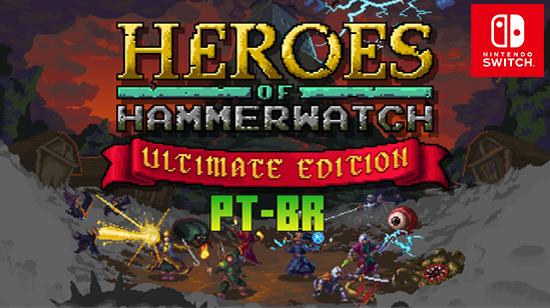

> Status do Projeto: ✅ (Concluído 100%) 
## 📥 Download: [v1.0](https://github.com/JUNIORGBJ/Heroes_of_Hammerwatch_PT_BR/releases/download/v1.0/Heroes_of_Hammerwatch_NINTENDO.SWITCH.v1.0.zip)

<h1 align="center"><figure>
  
</figure></h1>

## 📘Sobre a Tradução

⚠️ Port & Tradução ⚠️  
🎮 Port para Nintendo Switch: Traduções GBJ  
💻 Tradução Original (PC): Tikera

## ❓Por que este projeto

💬 Este patch ajuda jogadores a entender melhor a história do jogo em português.  
🛠️ Se puder colaborar com correções, revisão ou sugestões, sua ajuda será muito bem-vinda!

## 📋 Requisitos

🔓 Nintendo Switch desbloqueado com ATMOSPHERE

## 📦 Instalação

📁 Copie a pasta ```0100D2B00BC54000``` para: ```Atmosphere\Contents```

## 🧰 Ferramentas Utilizadas

💻 [Visual Studio Code](https://code.visualstudio.com)

## 💖 Apoie o Projeto

Se quiser contribuir:
[](https://picpay.me/gilsongbj)| Chave PIX:      | gilson.gbj@gmail.com |[](https://github.com/JUNIORGBJ/Fatal_Frame_Maiden_of_Black_Water_PT-BR)

🙏 Obrigado pelo apoio! 👋  
🎉 Divirta-se com o jogo traduzido!
